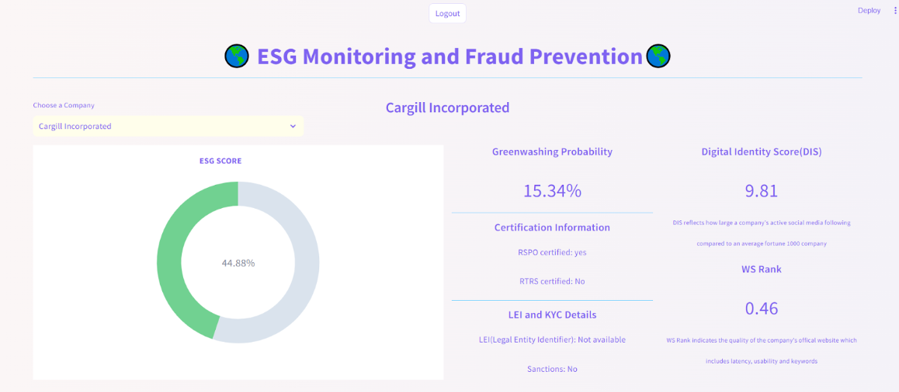
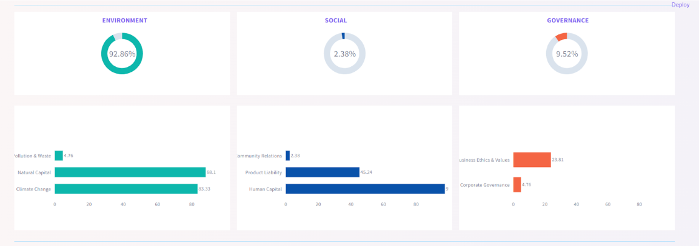
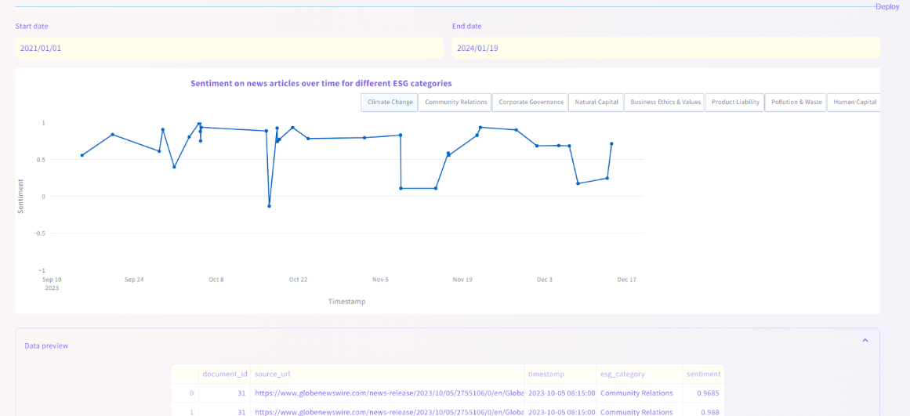

# User Interface

## Introduction

The User Interface Design task focuses on creating an intuitive and user-friendly interface for AI-driven ESG monitoring with greenwashing detection and digital identity assessment of companies.

## Features

### Company Selection

- **Choose a Company**: Users can type the company name in the “choose a company” field. The closest matching company names will be displayed below the field, allowing users to select the desired company.

### Results Provided

#### ESG Score

- **ESG Score**: The Environmental, Social, and Governance (ESG) score of the selected company.
- **Donut Plot**: A visual representation of the ESG score with color-coding for easy interpretation:
  - **Green**: Good and satisfactory standing
  - **Yellow**: Acceptable standing
  - **Red**: Unsatisfactory and unacceptable standing

#### Greenwashing Probability

- **Greenwashing Probability**: The probability that the company is misrepresenting its sustainability position based on provided information.

#### Digital Identity Score

- **Digital Identity Score**: Measures the volume of the company’s active social media presence in comparison with the average value of Fortune 1000 companies.

#### Certifications

- **RSPO Certification**: Indicates the company has acquired the certification for sustainable palm oil, ensuring compliance with sustainability requirements.
- **RTRS Certification**: Indicates the company is certified for responsible soy production, which includes:
  - Zero deforestation and zero conversion soy production
  - Valid for 5 years with annual surveillance audits
  - Compliance with principles and indicators for:
    - Legal Compliance and Good Business Practices
    - Responsible Labor Conditions
    - Responsible Community Relations
    - Environmental Responsibility
    - Good Agricultural Practices

#### Legal Entity Identifier (LEI) and Know Your Customer (KYC) Details

- **LEI**: A unique reference code used across markets and jurisdictions to identify a legally distinct entity engaging in financial transactions.
- **KYC**: A mandatory process for identifying and verifying the client's identity when opening an account and periodically over time.

#### Website Quality Score (WS Rank)

- **WS Rank**: Evaluates the quality of the company’s official website based on:
  - Loading latency
  - Usability
  - Keywords

#### Sentiment Time Trend

- **Sentiment Time Trend**: Enables users to select the start and end dates, as well as the ESG category, to view the sentiment trend over time for that specific ESG category.

## User Interface

The user interface is designed to be intuitive and informative, providing users with comprehensive insights into the selected company's ESG performance, greenwashing risks, digital identity, certifications, legal identifiers, and website quality.

